# **Favorita Retails Sales analysis and Forecast**
_**Author**: Thu Pham | **Date**: 03/2025_

## _**1. Project Background**_

&nbsp;&nbsp;&nbsp;&nbsp;&nbsp;&nbsp;Favorita is one of the most prominent retail chains in Ecuador, boasting nationwide presence and offering an extensive range of goods across various categories. With retail being a rapidly growing sector in the region, Favorita has the opportunity to leverage market expansion trends to boost performance. 

&nbsp;&nbsp;&nbsp;&nbsp;&nbsp;&nbsp;This project aims to analyze Favorita's retail sales data and forecast sales for the next 12–24 months. The insights will assist the Supply Chain team in optimizing inventory management, while also supporting Store Management teams in improving store performance (total revenues, growth, average sales,…) and capitalizing on emerging opportunities in Ecuador's dynamic retail sector. 

&nbsp;&nbsp;&nbsp;&nbsp;&nbsp;&nbsp;Insights and recommendations are provided on the following key objectives:
-	**Objective 1**: Indentify sales trend and revenue growth, discover seasonality patterns.
-	**Objective 2**: Regional performances and product category-level insights, pinpoint weak areas and high-performer, derive insights into market demand in products. 
-	**Objective 3**: Utilize advanced forecasting models to predict sales trends accurately, expected revenue growth to offer recommendations on inventory optimizations. 

The Python codes used to inspect and clean the data for this analysis can be found here [link].

Targed SQL queries regarding various business questions can be found here [link].

An interactive Tableau dashboard used to report and explore sales trends can be found here [link].

## _**2. Data Structure & Initial Checks**_
&nbsp;&nbsp;&nbsp;&nbsp;&nbsp;&nbsp;The companies main database structure as seen below consists of four tables: `sale_table`, `transaction`, `holiday_events`, `store` and `oil_price` with a total row count of over 300,000 records. A description of each table is as follows: 

**`sale_table`** (`train` in the original dataset):
- Each row represents the total sales by store and product family (identifies the type of product sold) at a given date.
- Additionally, the **`onpromotion`** column provides the total number of items in a product family that were promoted at a store.

**`transaction`**:
- Represents the total number of transactions that occurred in a store on a given date.

**`oil_price`**:
- Records the daily oil price.
- "WTI" refers to West Texas Intermediate, a grade of crude oil used as a benchmark in oil pricing.

**`holiday_events`**:
- Contains details about holidays or events that occurred by date, including their types, locations (e.g., National, Regional, Local), and specific location names (e.g., city or state).
- Includes a brief description of the holiday or event.
- The **`transferred`** column indicates whether the holiday was transferred to another date (True or False).

**`store_table`**:
- Contains information about the stores, including their unique identifiers, location, type, and cluster.

**`family_info`**:
- A table created by the analyst to re-categorize the product family for easier summarization.

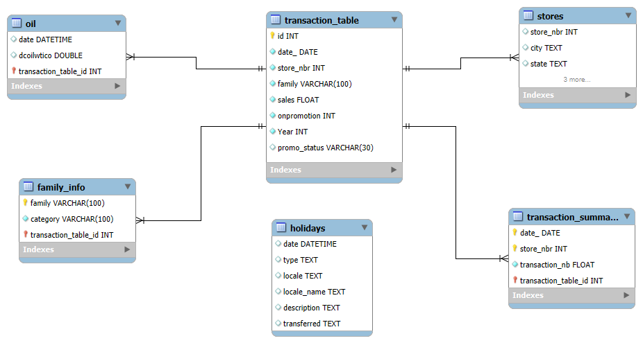

## _**3. Executive Summary**_
### *Overview of Findings (January 2013 - August 2017)*

&nbsp;&nbsp;&nbsp;&nbsp;&nbsp;&nbsp;The business achieved **strong cumulative growth** with **$1B in total revenue** and **141M total transactions**, reflecting a +39.9% revenue increase and +29.2% transaction growth from the same period prior year.While Favorita's revenue has grown significantly, transaction volume suggests room for expanding the customer base.

&nbsp;&nbsp;&nbsp;&nbsp;&nbsp;&nbsp;Following the last actual sales in August 2017, the forecast shows a **+19.1%** YoY sales growth to **$344M at the end of 2017**, slightly below 2016’s 19.8%, with transactions expected to increase by **+6.7%** over 2016.

&nbsp;&nbsp;&nbsp;&nbsp;&nbsp;&nbsp;Seasonal sales patterns show a clear peak in December around the Christmas holiday, followed by a decline in early January. Maintaining a robust supply chain is crucial to capitalize on these seasonal fluctuations. 

&nbsp;&nbsp;&nbsp;&nbsp;&nbsp;&nbsp;Store expansion remained steady, reaching 53 active locations by 2017. Revenue contribution is heavily concentrated geographically, with **Pinchita** representing our **largest market**, contributing over 54% of total revenue and the highest number of stores (19 locations). Category sales show broad growth across segments, with no major volatility. **Grocery and beverage products** made the largest contribution to total sales.

## _**4. Insights Deep dive:**_
### *4.1. Main Insight 1: Market expansion strategy is recommended to promote successful growth.*

- **Significant Revenue Expansion (2013-2016):** Revenue grew substantially, *from $140 million in 2013 to $289 million* in 2016.  This growth was most pronounced in 2014, with a 49% increase, driven by a significant rise in average transaction value from $4.8 to $9.3, despite relatively consistent transaction volume.
- **Potential for Transaction Growth:** While average transaction values increased, the size of sales territories remained unchanged. This suggests that the revenue growth was primarily fueled by higher-value purchases, potentially due to product price increases or expanded product offerings. 

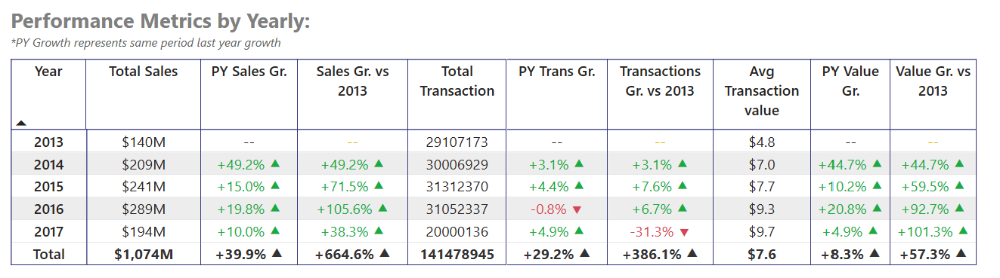

- **New stores (opened 2014-2017)**: showed significant individual transaction growth but had a limited overall market impact.
  - New stores opened each year 01 store in May 2014, 05 stores in 2015, 01 store in April 2017. Individual store transactions often increased substantially (e.g., Store 53 grew 75.4% from 2014 to 2015). However, **each new store's yearly transaction percentage remained below 0.4%**, indicating a small contribution to the total market during 2014-2017.

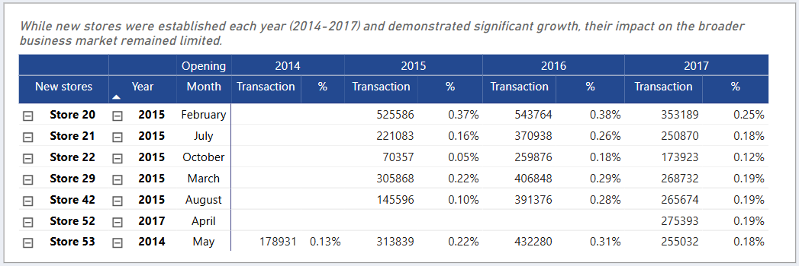

### *4.2. Main Insight 2: Key Seasonal Sale Pattern*

**a. There’s an evident seasonal trend from the later half of the years.**
- *Consistent Year-End Peak:* Sales consistently rise from November(Black Friday, Cyber Monday) to December, where there’s no sell report on national holiday (Navidad/Chrismast).
- *A sharp decline occurs in January* (minimal sales in Christmast week/ New Year Holiday / Primer dia del ano) following the December holiday peak, followed by a recovery in March. April typically sees a slight decrease in sales, with the exception of 2016 ("Terremoto Manabí" earthquake on April, 2016)

- *Stable Transaction Value:* Average purchase value remains relatively stable despite sales fluctuations.
- Despite these fluctuations, the moving average of daily sales indicates a gradual sales growth from June to August, leading into the peak season.

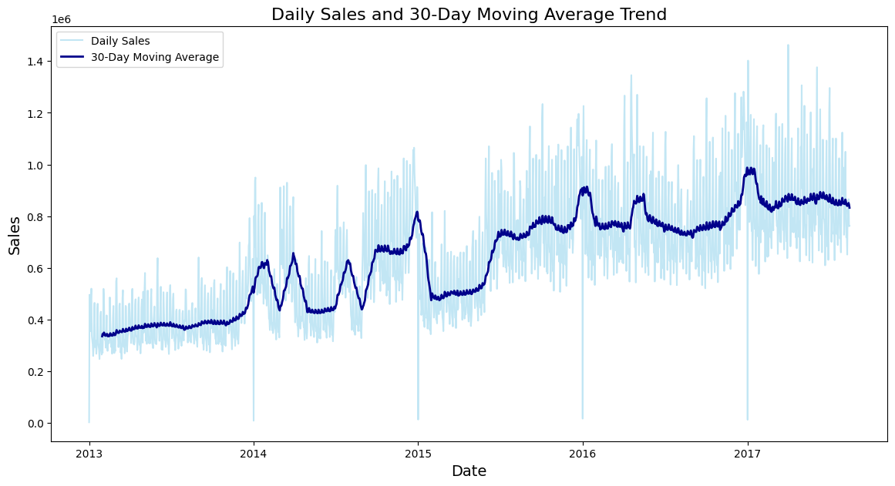

**b. Weekdays and specific holidays, events:**
- Cyber Monday's Seasonality Index was consistently higher than Black Friday's (2014-2016), indicating a stronger impact on spending.

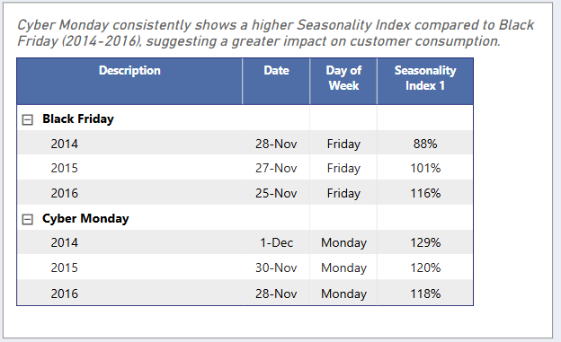

- There’re some sale-impacted special events happened in 2016, which are not likely to reoccurr:
  - "Terremoto Manabí" earthquake on April, 2016: consumption demand increased 
  - "World Cup 2014" on June-July, 2014: seemingly no significant sales impact

- **Weekends consistently outperform weekdays**, with Saturdays averaging $444.7 and Sundays $473.4 across the year, peaking at $514.9 and $539.1 in December respectively.

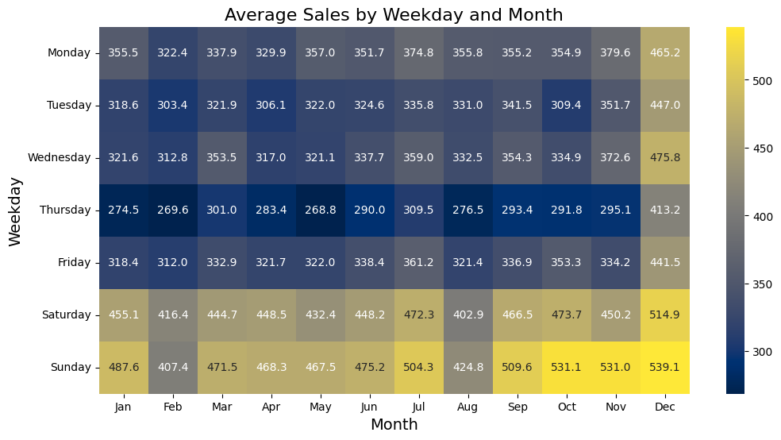

### *4.3. Main Insight 3: Sales Driven Factors*

**a. Promotion Program:**
- The data reveals a significant strategic shift towards promotions, with their influence on total revenue growing substantially. Starting with 100% non-promotional sales in 2013, **promotions accounted for 93.8% of sales by 2017**, highlighting their increasing importance.
- 2014 marked a key transition, where promotional sales began to gain traction, contributing 42.2% of total sales.

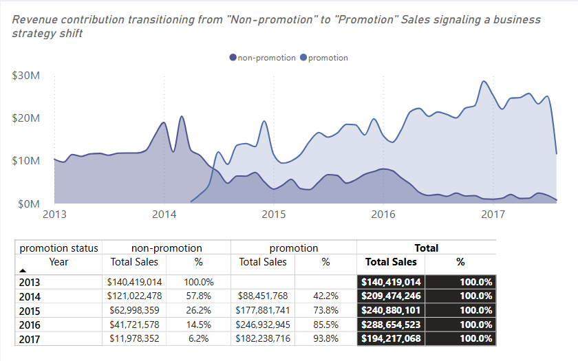

**b. Product: A slight shift from core (grocery, beverages) to lifestyle (pet, apparel) categories is occurring.**
- **Grocery Dominance:** Despite a fluctuating and slightly declining percentage contribution (58.2% in 2013 to 51.5% in 2017), grocery remains the largest revenue contributor, underpinning core business operations.
- While beverage contributions declined from 17.5% to 14.8%, suggesting reduced consumer demand, *categories like pet & other saw significant growth*, rising from 3.6% to 8.1%, indicating a shift in consumer preferences.

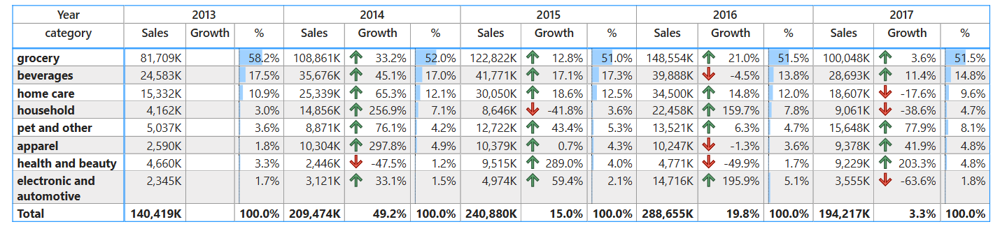

**c. Sales teritories: Highly concentrated in Pinchita**
- *Sales distribution is concentrated in major states/cities* (Pichincha/Quito, Guayas/Guayaquil) with over **50% contribution**, showing minimal fluctuation over 12 months.
- All states shared the same grow trend over the years.
- Last 12 months, **Pichincha (53.4%, 19 stores)** and **Guayas (15.3%, 11 stores)** are top performers. Second-tier states (Azuay, Tungurahua, Santo Domingo de los Tsachilas, Manabi, El Oro) contribute 3.3%-5.2% and average 2 stores. Lower-performing locations have 1 store (Pastaza lowest).

- The customer reference in difference location is consistently alike: The product distribution seemed to be similar between locations (with grocery being the dominating goods).

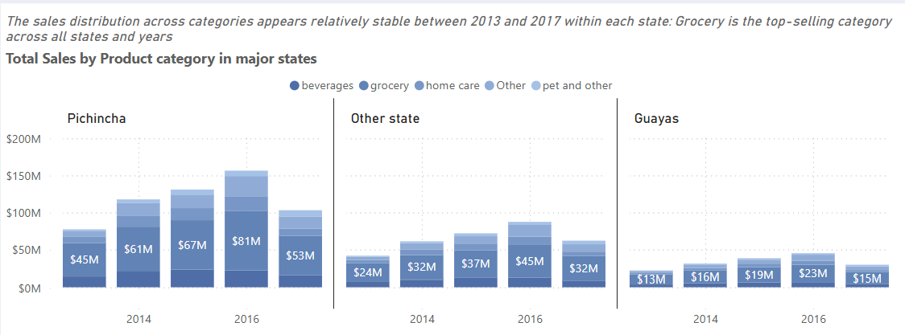

- Up to now, **Type A ($353M) and Type D ($351M)** are the top-performing store types. In the leading state Pichincha, sales are heavily concentrated in these two types, with 81.8% of Type A and 53.5% of Type D sales. In contrast, Other states generate more revenue from Types C ($115.8M), D ($112.6M), and E ($16M-$43M), indicating a broader distribution of store performance outside Pichincha.

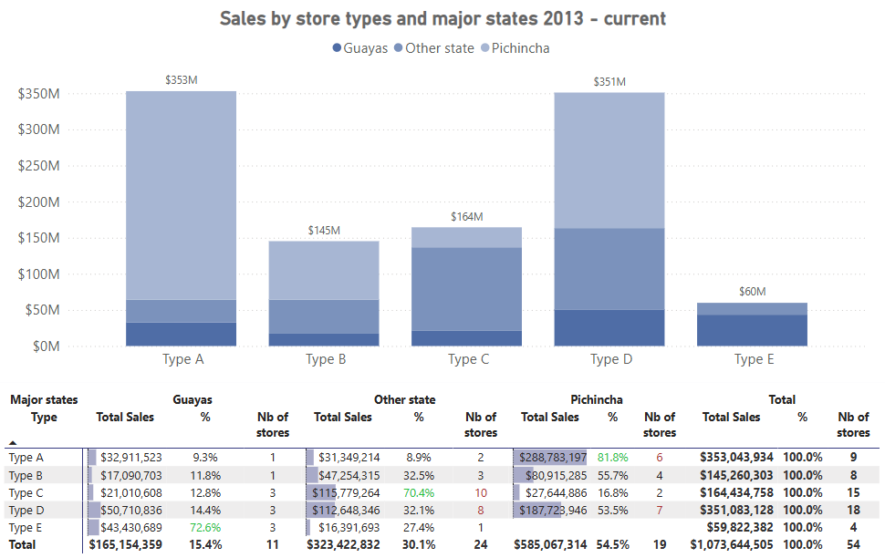

## _**5. Sales Forecasting Model:**_
### *5.1. Sales forecasting using Decision tree based model:*
&nbsp;&nbsp;&nbsp;&nbsp;&nbsp;&nbsp;Sales forecasting was conducted using powerful decision tree models—XGBoost and LightGBM—to identify the most impactful drivers of sales performance:
- The most influential factors are **store-specific performance (`store_nbr`), product category (`family`), and the presence of promotions (`onpromotion`)**, indicating that store characteristics and marketing efforts heavily influence sales predictions.
- Seasonality effects are clearly captured through variables such as elasped days (`day_n`), giving month, and weekday, aligning with observed annual sales patterns.
- Holidays and special events (`holiday`), show minimal impact, suggesting they are not key drivers in the current forecasting model. 
- **`dcoilwtico` (daily oil price based on the WTI benchmark)** showed moderate importance, as changes in oil prices can influence transportation and distribution costs, potentially affecting product availability, pricing, and overall consumer spending behavior.
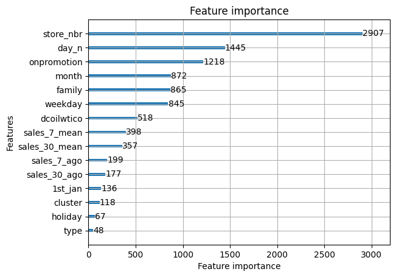

&nbsp;&nbsp;&nbsp;&nbsp;&nbsp;&nbsp;To apply the forecast model, the current promotion plan is assumed to continue for each product family.

&nbsp;&nbsp;&nbsp;&nbsp;&nbsp;&nbsp;The transaction volume is forecasted based on projected sales, assuming no new store openings during the forecast period.

### *5.2. Key Projection Insights:*
1. **Strong Full-Year 2017 Performance:** 2017 is expected to conclude as a strong year. Total sales reached **~$329M (+14.1% YoY vs 2016)** and total transactions were **~33K (+6.7% YoY vs 2016)**, continuing the positive multi-year trend.
 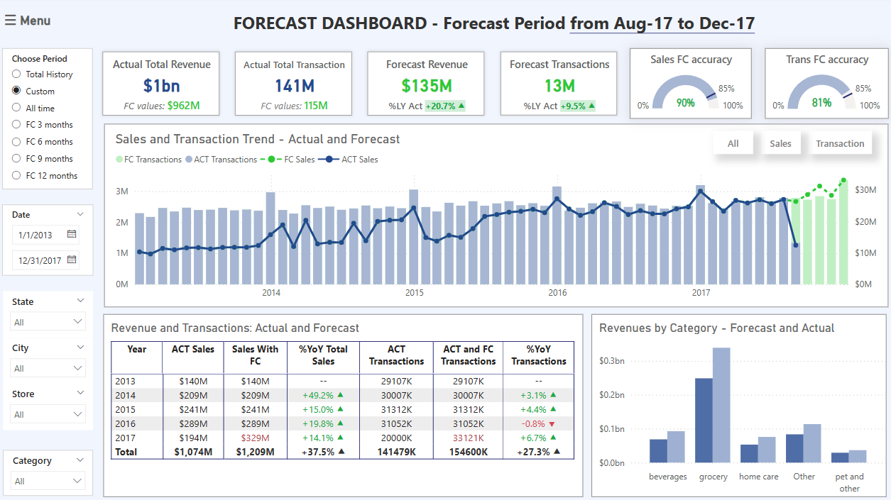
2. **Forecasted Revenue Growth:** The forecast projects $135M revenue for August-December 2017, a 20.7% increase compared to the same period last year. However, this lead to a lower annual revenue growth compared to the growth from 2016 (14.1% vs. 19.8%), suggesting a potential shift in growth trajectory.
   -  **Growth Rate Deceleration potential interpretations**: the Xgboost model might be capturing a perceived cyclical growth pattern that appears to have started around 2015, as suggested by the revenue trend chart. The forecast for 2017 and beyond could be influenced by the model's extrapolation of this assumed cycle.
   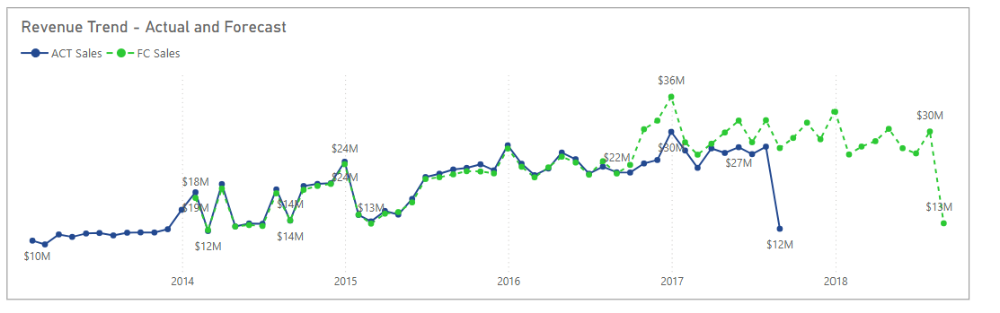

3. **Stable Transaction Volume Historically and in Projections:** The volume of transactions has shown stability historically, without significant fluctuations. Forecasted transactions for August-December 2017 are **$13M, a 9.5% increase YoY**, indicating an expectation of continued customer activity growth which conclude the year 2017 total transactions volume at **33M transactions and +6.7% YoY growth**. This consistent trend is projected to continue over the next 12 months. With a **forecasting accuracy of 81%** for transactions, the model demonstrates a reasonable level of reliability in predicting this metric.

4. **Inventory Planning:** Plan inventory based on projections, with a focus on the forecasted sales peak from late 2017 to early 2018 to prevent understocking. Product category contributions are expected to remain stable, with grocery continuing as the primary consumption group.
### *5.3. Caveats and further consideration:**
&nbsp;&nbsp;&nbsp;&nbsp;&nbsp;&nbsp;The confirmation of the recurring cyclical pattern mentioned above is not yet statistically robust. The forecast revenue deviation could be attributed to other factors, such as specific market situatation, econimic headwinds, or competitor actions, rather than a consistent cyclical behavior.

&nbsp;&nbsp;&nbsp;&nbsp;&nbsp;&nbsp;Therefore, it is crucial to consider: 
 - Identify underlying drivers and the applied strategic plan.
 - Incorporate external factors such as economic indicators, competitor actitivies,etc.
 - Monitor model performance to adapt to any evolving patterns. 
## _**6. Recommendations**_

&nbsp;&nbsp;&nbsp;&nbsp;&nbsp;&nbsp;Based on the insights and findings above, we would recommend the Favorita Store managers, Sales and Marketing team to consider the following: 

**1. The key driver of sales growth is average spending per transaction.** To ensure sustainable growth, the strategy should shift toward market expansion by:
  - Investing in new stores to tap into untapped markets
  - Boosting customer traffic through targeted campaigns, loyalty programs, promotions, or local partnerships to increase transaction volume

**2. The current incremental store rollout has limited impact.** Consider adopt cluster-based expansion or regional hub models to scale more effectively.

**3. Sales territories are heavily concentrated in central regions**, especially Pichincha, highlighting room for expansion. Options can be tailored to current sales goals and financial priorities:
  - Expand within high-growth areas like Pichincha for a cost-efficient approach
  - Invest in developing potential markets like Azuay, Tungurahua, or Santo Domingo de los Tsáchilas for a more aggressive growth strategy

**4. Prioritize High-Impact Store Formats:**
  - Focus expansion efforts on Type A and D stores, which are proven top performers and are heavily represented in high-revenue areas.
  - Evaluate market demographics to identify where these formats could replicate their success.

**5. Promotional sales surged, while consumer interest is gradually shifting from core categories (grocery, beverages) to lifestyle products.** Captivate and optimize these trends by: 
  - Optimize promotion strategy to maintain revenue while protecting margins with data-driven campaigns.
  - Expand lifestyle categories to align with shifting consumer preferences, while sustaining grocery as the core anchor.
  - Customize Store Offerings by Region: Tailor product and promotion mixes based on store type and regional performance

**6. Capitalize on Strong 2017 Trajectory:** Building on the projected robust full-year sales growth of 14.1% YoY and transaction growth of 6.7% YoY by focus on conserving initiatives (targeted campaigns, loyalty programs, promotions, local partnerships, inventory management) that align with the primary driver of sales growth: average spending per transaction. 

**7. To address potential forecast discrepency**, it is recommended to refine the forecast for the rest of 2017 as well as budgeting for 2018: 
 - Adjust the model with considerations mentioned in *Section 5.3.*
 - Supplementing forecast outputs with thorough market analysis, competitor benchmarking, and investigation of prevailing conditions.
 - Incorporating concrete strategic plans, such as upcoming promotional programs or store expansion campaigns, into forecast adjustments.

**8. Optimize Inventory Management for Sustained Performance:**
 - Develop inventory scenario plans (conservative forecast, potential growth with new stores).
 - Establish close monitoring of key inventory performance indicators (KPIs) and adopt flexible inventory management protocols (e.g., shorter lead times, more frequent deliveries, responsive ordering) to adapt to demand fluctuations.
 - Prioritize management of perishable goods within the dominant grocery segment, focusing on shelf-life and efficient stock rotation to minimize waste and ensure product freshness.

