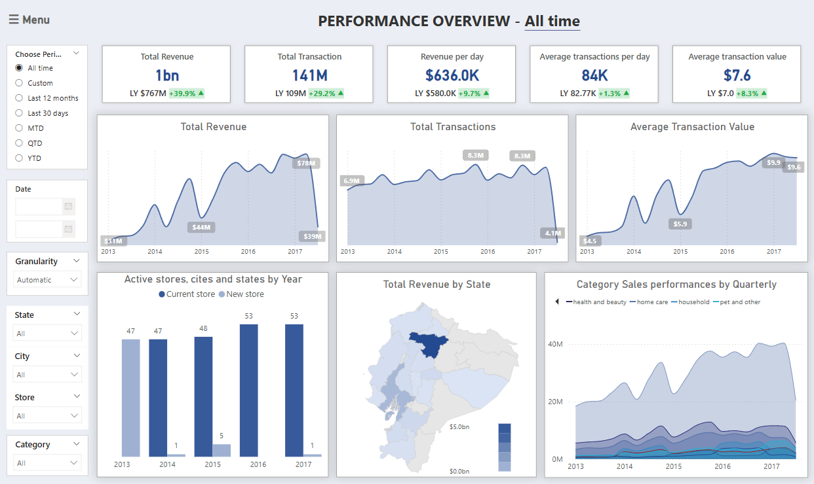

# **Favorita Retails Sales analysis and Forecast**
_**Author**: Thu Pham | **Date**: 03/2025_

## _**1. Project Background**_

&nbsp;&nbsp;&nbsp;&nbsp;&nbsp;&nbsp;Favorita is one of the most prominent retail chains in Ecuador, boasting nationwide presence and offering an extensive range of goods across various categories. With retail being a rapidly growing sector in the region, Favorita has the opportunity to leverage market expansion trends to boost performance. 

&nbsp;&nbsp;&nbsp;&nbsp;&nbsp;&nbsp;This project aims to analyze Favorita's retail sales data and forecast sales for the next 12–24 months. The insights will assist the Supply Chain team in optimizing inventory management, while also supporting Store Management teams in improving store performance (total revenues, growth, average sales,…) and capitalizing on emerging opportunities in Ecuador's dynamic retail sector. 

&nbsp;&nbsp;&nbsp;&nbsp;&nbsp;&nbsp;Insights and recommendations are provided on the following key objectives:
-	**Objective 1**: Indentify sales trend and revenue growth, discover seasonality patterns.
-	**Objective 2**: Regional performances and product category-level insights, pinpoint weak areas and high-performer, derive insights into market demand in products. 
-	**Objective 3**: Utilize advanced forecasting models to predict sales trends accurately, expected revenue growth to offer recommendations on inventory optimizations. 

The Python codes used to inspect and clean the data for this analysis can be found here [link].

Targed SQL queries regarding various business questions can be found here [link].

An interactive Tableau dashboard used to report and explore sales trends can be found here [link].

## _**2. Data Structure & Initial Checks**_
&nbsp;&nbsp;&nbsp;&nbsp;&nbsp;&nbsp;The companies main database structure as seen below consists of four tables: `sale_table`, `transaction`, `holiday_events`, `store` and `oil_price` with a total row count of over 300,000 records. A description of each table is as follows: 

**`sale_table`** (`train` in the original dataset):
- Each row represents the total sales by store and product family (identifies the type of product sold) at a given date.
- Additionally, the **`onpromotion`** column provides the total number of items in a product family that were promoted at a store.

**`transaction`**:
- Represents the total number of transactions that occurred in a store on a given date.

**`oil_price`**:
- Records the daily oil price.
- "WTI" refers to West Texas Intermediate, a grade of crude oil used as a benchmark in oil pricing.

**`holiday_events`**:
- Contains details about holidays or events that occurred by date, including their types, locations (e.g., National, Regional, Local), and specific location names (e.g., city or state).
- Includes a brief description of the holiday or event.
- The **`transferred`** column indicates whether the holiday was transferred to another date (True or False).

**`store_table`**:
- Contains information about the stores, including their unique identifiers, location, type, and cluster.

**`family_info`**:
- A table created by the analyst to re-categorize the product family for easier summarization.

## _**3. Executive Summary**_
### *Overview of Findings (January 2013 - August 2017)*

&nbsp;&nbsp;&nbsp;&nbsp;&nbsp;&nbsp;The business achieved **strong cumulative growth** with **$1B in total revenue** and **141M total transactions**, reflecting a +39.9% revenue increase and +29.2% transaction growth from the same period prior year.While Favorita's revenue has grown significantly, transaction volume suggests room for expanding the customer base.

&nbsp;&nbsp;&nbsp;&nbsp;&nbsp;&nbsp;Seasonal sales patterns show a clear peak in December around the Christmas holiday, followed by a decline in early January. Maintaining a robust supply chain is crucial to capitalize on these seasonal fluctuations. 

&nbsp;&nbsp;&nbsp;&nbsp;&nbsp;&nbsp;Store expansion remained steady, reaching 53 active locations by 2017. Revenue contribution is heavily concentrated geographically, with **Pinchita** representing our **largest market**, contributing over 54% of total revenue and the highest number of stores (19 locations). Category sales show broad growth across segments, with no major volatility. **Grocery and beverage products** made the largest contribution to total sales.

## _**4. Insight Deepdive**_
### *4.1. Main Insight 1: Market expansion strategy is recommended to promote successful growth.*

- **Significant Revenue Expansion (2013-2016):** Revenue grew substantially, *from $140 million in 2013 to $289 million* in 2016.  This growth was most pronounced in 2014, with a 49% increase, driven by a significant rise in average transaction value from $4.8 to $9.3, despite relatively consistent transaction volume.
- **Potential for Transaction Growth:** While average transaction values increased, the size of sales territories remained unchanged. This suggests that the revenue growth was primarily fueled by higher-value purchases, potentially due to product price increases or expanded product offerings. 

- **New stores (opened 2014-2017)**: showed significant individual transaction growth but had a limited overall market impact.
  - New stores opened each year 01 store in May 2014, 05 stores in 2015, 01 store in April 2017. Individual store transactions often increased substantially (e.g., Store 53 grew 75.4% from 2014 to 2015). However, **each new store's yearly transaction percentage remained below 0.4%**, indicating a small contribution to the total market during 2014-2017.

### *4.2. Main Insight 2: Key Seasonal Sale Pattern*

**a. There’s an evident seasonal trend from the later half of the years.**
- *Consistent Year-End Peak:* Sales consistently rise from November(Black Friday, Cyber Monday) to December, where there’s no sell report on national holiday (Navidad/Chrismast).
- *A sharp decline occurs in January* (minimal sales in Christmast week/ New Year Holiday / Primer dia del ano) following the December holiday peak, followed by a recovery in March. April typically sees a slight decrease in sales, with the exception of 2016 ("Terremoto Manabí" earthquake on April, 2016)

- *Stable Transaction Value:* Average purchase value remains relatively stable despite sales fluctuations.
- Despite these fluctuations, the moving average of daily sales indicates a gradual sales growth from June to August, leading into the peak season.

**b. Weekdays and specific holidays, events:**
- Cyber Monday's Seasonality Index was consistently higher than Black Friday's (2014-2016), indicating a stronger impact on spending.

- There’re some sale-impacted special events happened in 2016, which are not likely to reoccurr:
  - "Terremoto Manabí" earthquake on April, 2016: consumption demand increased 
  - "World Cup 2014" on June-July, 2014: seemingly no significant sales impact

- **Weekends consistently outperform weekdays**, with Saturdays averaging $444.7 and Sundays $473.4 across the year, peaking at $514.9 and $539.1 in December respectively.

### *4.3. Main Insight 3: Sales Driven Factors*

**a. Promotion Program:**
- The data reveals a significant strategic shift towards promotions, with their influence on total revenue growing substantially. Starting with 100% non-promotional sales in 2013, **promotions accounted for 93.8% of sales by 2017**, highlighting their increasing importance.
- 2014 marked a key transition, where promotional sales began to gain traction, contributing 42.2% of total sales.

**b. Product: A slight shift from core (grocery, beverages) to lifestyle (pet, apparel) categories is occurring.**
- **Grocery Dominance:** Despite a fluctuating and slightly declining percentage contribution (58.2% in 2013 to 51.5% in 2017), grocery remains the largest revenue contributor, underpinning core business operations.
- While beverage contributions declined from 17.5% to 14.8%, suggesting reduced consumer demand, *categories like pet & other saw significant growth*, rising from 3.6% to 8.1%, indicating a shift in consumer preferences.

**c. Sales teritories: Highly concentrated in Pinchita**
- *Sales distribution is concentrated in major states/cities* (Pichincha/Quito, Guayas/Guayaquil) with over **50% contribution**, showing minimal fluctuation over 12 months.
- All states shared the same grow trend over the years.
- Pichincha (53.4%, 19 stores) and Guayas (15.3%, 11 stores) are top performers. Second-tier states (Azuay, Tungurahua, Santo Domingo de los Tsachilas, Manabi, El Oro) contribute 3.3%-5.2% and average 2 stores. Lower-performing locations have 1 store (Pastaza lowest).

- The customer reference in difference location is alike: The product distribution seemed to be similar betweens stores (with grocery being the dominating goods).

